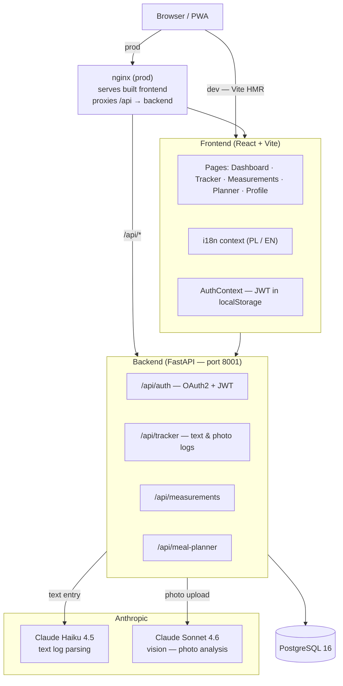

# NomNom

A meal tracking and planning PWA for two people. You describe what you ate (or photograph it), the app extracts the nutrition data and shows you where you stand against your daily targets — without asking follow-up questions.

**Live:** https://fit.spryszynski.pl

![screenshot placeholder]
![demo gif placeholder]

---

## Tech Stack


---

## Architecture



---

## Features

### Implemented

**Daily Tracker**
- Type any food or exercise description → Claude Haiku parses it into kcal, protein, fat, carbs
- Upload a photo → Claude Sonnet Vision identifies the dish and estimates nutrition
- Zero follow-up questions: if confidence exceeds the threshold the result is accepted immediately
- Demo mode when `ANTHROPIC_API_KEY` is not set — returns placeholder data instead of failing with 500

**Dashboard**
- Calorie ring showing consumed / burned / net vs. daily target
- Macro progress bars (protein, fat, carbs) with per-macro goals
- Chronological entry list with food / exercise icons and timestamps

**Measurements**
- Weight entry form with BMI calculation and a contextual BMI scale
- Weight history table with per-entry delta (change vs. previous entry)
- SVG line chart for weight trend

**Profile**
- Inline-editable goal fields: calorie target, weight target, TDEE
- Language toggle — Polish / English, persisted in `localStorage`

**Auth**
- JWT-based login, OAuth2 password flow
- bcrypt password hashing via passlib
- Hardcoded test account for local development (`admin` / `1234`)

**Infrastructure**
- Progressive Web App — installable, static asset caching via Workbox
- Docker Compose with separate `dev` and `prod` profiles
- Production: nginx serves the Vite bundle and reverse-proxies `/api` to FastAPI

### Scaffolded / In Progress

| Feature | Status |
|---|---|
| Meal planner (Claude Sonnet generation) | UI exists, backend stub returns `{"message": "not implemented"}` |
| Food / exercise log DB persistence | Endpoints wired, DB writes not yet implemented |
| Body measurements DB persistence | Endpoints wired, DB writes not yet implemented |
| USDA FoodData Central nutrition lookup | Key in `.env`, no integration yet |

---

## Getting Started

### Prerequisites

[Docker Desktop](https://www.docker.com/products/docker-desktop/) — includes Compose. No Node, Python, or PostgreSQL required on the host.

### Setup

```bash
git clone https://github.com/wiktorspryszynski/nom-nom.git
cd nom-nom

cp .env.example .env
```

Open `.env` and set at minimum:

```env
POSTGRES_PASSWORD=something_strong
SECRET_KEY=a_long_random_string   # e.g. output of: openssl rand -hex 32
ANTHROPIC_API_KEY=sk-ant-...       # optional — app runs in demo mode without it
```

### Run — development

```bash
COMPOSE_PROFILES=dev docker compose up --build
```

| Service | URL |
|---|---|
| Frontend (Vite HMR) | http://localhost:5174 |
| Backend (FastAPI) | http://localhost:8001 |
| API docs (Swagger) | http://localhost:8001/docs |

### Run — production-like

```bash
COMPOSE_PROFILES=prod docker compose up --build
```

| Service | URL |
|---|---|
| Frontend (nginx) | http://localhost:8100 |
| Backend | http://localhost:8001 (internal only) |

> In production, place a reverse proxy (Caddy, nginx on the host, etc.) in front of ports 8100 and 8001 and terminate TLS there.

---

## Environment Variables

| Variable | Required | Description | Example |
|---|---|---|---|
| `COMPOSE_PROFILES` | Yes | Which Docker Compose profile to activate | `dev` or `prod` |
| `POSTGRES_USER` | Yes | PostgreSQL username | `nomnom` |
| `POSTGRES_PASSWORD` | Yes | PostgreSQL password | `change_me` |
| `POSTGRES_DB` | No | Database name (default: `nomnom`) | `nomnom` |
| `POSTGRES_HOST` | Yes | Hostname of the DB service | `db` |
| `SECRET_KEY` | Yes | JWT signing secret — must be long and random | `openssl rand -hex 32` |
| `ANTHROPIC_API_KEY` | No | Claude API key. Without it, tracker returns demo responses | `sk-ant-api03-...` |
| `CORS_ORIGINS` | Yes | Comma-separated allowed origins | `http://localhost:5174,https://fit.spryszynski.pl` |
| `USDA_API_KEY` | No | USDA FoodData Central key (not yet integrated) | `DEMO_KEY` |

---

## Decisions & Tradeoffs

### Haiku for text, Sonnet for vision

Text parsing (food descriptions, exercise entries) uses Claude Haiku 4.5. Extracting structured nutrition data from free-form text is well within Haiku's capability and costs roughly 10× less per token than Sonnet. Photo analysis requires Sonnet 4.6 — Haiku does not support image inputs. Splitting by modality keeps AI costs under ~$2/month for two active users.

### Direct LLM estimation instead of a nutrition API

The design includes USDA FoodData Central as the primary nutrition source with Open Food Facts as fallback. In practice, the LLM returns structured estimates directly, which was faster to ship and handles ambiguous inputs ("a bowl of mom's soup") better than a database lookup that expects a canonical food name. The tradeoff is accuracy — database values are lab-measured, LLM values are estimated. `USDA_API_KEY` is already wired in `.env` for when this gap matters enough to close.

### No Redis, no server-side sessions

All session state lives in a JWT stored in `localStorage`. The backend is fully stateless. The tradeoff is that tokens cannot be invalidated before expiry without adding a denylist. For a closed two-user app this is acceptable; adding Redis later is straightforward.

### Tailwind v4

Tailwind v4 has no `tailwind.config.js` — configuration is CSS-first. This removes one config file and keeps theme tokens colocated with styles. The tradeoff is that v4 broke several v3 patterns mid-build (e.g. arbitrary-property syntax, plugin API). The decision was to stay current rather than pin v3 and migrate later.

### EAV schema for body measurements

Body metric types (weight, body fat %, water %, muscle mass) are stored as `(metric_type, value)` rows rather than typed columns. Adding a new metric type requires no schema migration. The tradeoff is that enforcing type constraints and writing typed queries is harder. For a dataset that's read primarily to render trend charts, this is a reasonable exchange.

### Docker Compose profiles over separate files

One `docker-compose.yml` with two profiles (`dev`, `prod`) instead of a base file plus `docker-compose.override.yml`. Dev mounts source directories for hot reload; prod builds optimised images. Profiles make the intent explicit at invocation time and avoid the file-merge confusion that overrides introduce.

### No CI/CD

There is no automated pipeline. Deploy workflow: `git pull` on the VPS, `docker compose up --build`. For a side project with two users and no uptime SLA, the setup cost of GitHub Actions is not justified at this stage.

---

## Project Structure

```
nom-nom/
├── backend/
│   ├── app/
│   │   ├── main.py          # FastAPI app, middleware, router registration
│   │   ├── config.py        # Pydantic settings (reads from env)
│   │   ├── database.py      # SQLAlchemy engine + session factory
│   │   ├── models/          # ORM models (User, …)
│   │   ├── routers/         # auth, tracker, measurements, meal_planner, demo
│   │   └── schemas/         # Pydantic request/response schemas
│   ├── Dockerfile           # dev — uvicorn --reload
│   ├── Dockerfile.prod      # prod — 2 uvicorn workers, no reload
│   └── requirements.txt
├── frontend/
│   ├── src/
│   │   ├── pages/           # DashboardPage, MeasurementsPage, PlannerPage, ProfilePage
│   │   ├── components/      # BottomNav, PhotoLogSheet, CalorieCalculatorModal, …
│   │   ├── context/         # AuthContext, LanguageContext
│   │   ├── i18n/            # translations.ts (PL + EN keys)
│   │   └── assets/          # NomNom character SVGs
│   ├── Dockerfile           # dev — Vite dev server
│   ├── Dockerfile.prod      # prod — Node build stage → nginx:alpine
│   └── package.json
├── docker-compose.yml       # dev + prod profiles
└── .env.example
```
