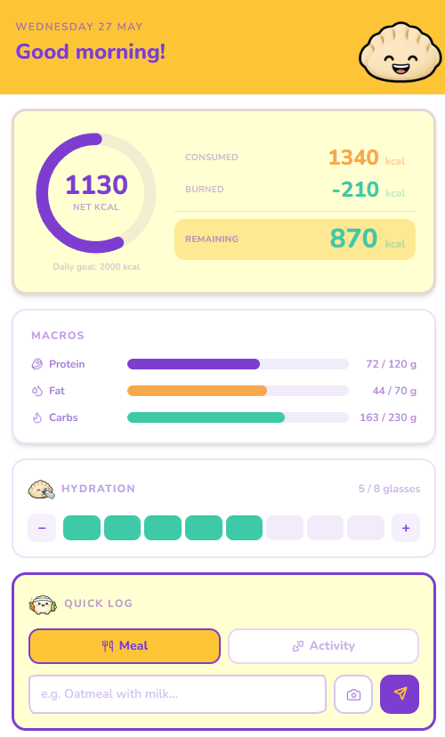
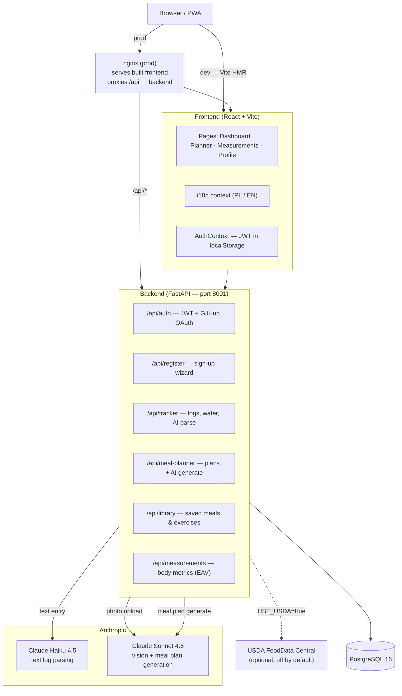

<div align="center">
  
</div>

# NomNom

A meal tracking and planning PWA.<br>
You take a photo or describe what you ate, the app extracts the nutrition data and shows you where you stand against your daily targets — without asking follow-up questions.

**Live:** https://fit.spryszynski.pl

> **NOTE:** This project is a work in progress.

<div align="center">
  
</div>

---

## Tech Stack


---

## Architecture



---

## Features

### Implemented

**Daily tracker (Dashboard — `/`)**
- Text log → Claude Haiku parses food or exercise into kcal and macros; auto-saves when confidence is high enough
- Photo log → Claude Sonnet Vision identifies the dish; portion multiplier (¼–1×) before save
- Manual entry form with saved-item autocomplete and optional AI macro guess
- Water intake widget (glasses per day)
- Calorie ring (consumed / burned / net vs. daily target) and macro progress bars
- Chronological entry list with edit (food) and delete
- Optional USDA fast path for short English food names when `USE_USDA=true` and `USDA_API_KEY` is set (off by default)
- AI unavailable badge when `ANTHROPIC_API_KEY` is missing; demo accounts have a lifetime AI call cap

**Meal planner (`/planner`)**
- AI-generated weekly plans via Claude Sonnet (`POST /api/meal-planner/generate`)
- Manual add / edit / delete meals per day and meal slot (breakfast, lunch, dinner, snack)
- Mark plan items as eaten → creates linked food log entries
- “Saved” tab — personal library of favourite foods and exercises (`/api/library`)
- Embedded view of today’s log on the Plan tab

**Measurements (`/measurements`)**
- Weight entry with BMI calculation and contextual BMI scale
- Body composition metrics (body fat %, water %, muscle mass) via EAV schema
- Weight history table with per-entry delta and SVG trend chart
- All data persisted to PostgreSQL

**Profile (`/profile`)**
- Editable goals: calorie target, weight target, TDEE, protein target, height
- TDEE and calorie-target calculators (modals)
- Language toggle — Polish / English (UI `localStorage`; default Polish)
- Demo account AI usage meter

**Auth**
- JWT login (OAuth2 password flow), bcrypt via passlib
- GitHub OAuth sign-in when `GITHUB_CLIENT_ID` / `VITE_GITHUB_CLIENT_ID` are configured
- Three-step registration wizard (profile → body → goals); production uses GitHub-only sign-up (`GITHUB_ONLY = true` in frontend config)
- Seeded demo account: `demo@nomnom.app` / `demo1234` (15 lifetime AI calls)

**Infrastructure**
- Progressive Web App — installable, static asset caching via Workbox (`vite-plugin-pwa`)
- Docker Compose with separate `dev` and `prod` profiles
- Alembic migrations applied automatically at backend startup
- Production: nginx serves the Vite bundle and reverse-proxies `/api` to FastAPI
- CI: push to `main` triggers SSH deploy to the VPS

### Not yet implemented

| Feature | Notes |
|---|---|
| Shopping list | No models or endpoints yet |
| Recipe generation | `recipe_text` column exists on plan items but is never populated |
| Meal selection workflow | No “generate 10–12 proposals → pick subset” card UI |
| Chat-based plan edits | No conversational meal-plan modifications |
| USDA search in UI | Backend `GET /api/tracker/search` exists; frontend does not call it |
| Open Food Facts fallback | Not integrated |
| MET-based exercise calories | `met_value` column exists; exercise kcal comes from AI / manual entry |
| Preference learning (ML) | No `meal_feedback` or `user_preference_profiles` tables yet |
| Account upgrade (demo → full) | `account_type` enum exists; no promotion endpoint |

---

## Getting Started

### Prerequisites

[Docker Desktop](https://www.docker.com/products/docker-desktop/) — includes Compose. No Node, Python, or PostgreSQL required on the host.

### Setup

```bash
git clone https://github.com/wiktorspryszynski/nom-nom.git
cd nom-nom

cp .env.example .env
```

Open `.env` and set at minimum:

```env
POSTGRES_PASSWORD=something_strong
SECRET_KEY=a_long_random_string   # e.g. output of: openssl rand -hex 32
ANTHROPIC_API_KEY=sk-ant-...       # optional — AI features disabled without it
```

For GitHub sign-in, also set `GITHUB_CLIENT_ID`, `GITHUB_CLIENT_SECRET`, `GITHUB_REDIRECT_URI`, and `VITE_GITHUB_CLIENT_ID` (see `.env.example`).

### Run — development

```bash
COMPOSE_PROFILES=dev docker compose up --build
```

| Service | URL |
|---|---|
| Frontend (Vite HMR) | http://localhost:5174 |
| Backend (FastAPI) | http://localhost:8001 |
| API docs (Swagger) | http://localhost:8001/docs |
| PostgreSQL | localhost:5433 |

Log in with the seeded demo account (`demo@nomnom.app` / `demo1234`) or complete GitHub OAuth registration.

### Run — production-like

```bash
COMPOSE_PROFILES=prod docker compose up --build
```

| Service | URL |
|---|---|
| Frontend (nginx) | http://localhost:8100 |
| Backend | http://localhost:8001 (internal only) |

> In production, place a reverse proxy (Caddy, nginx on the host, etc.) in front of ports 8100 and 8001 and terminate TLS there.

---

## Environment Variables

| Variable | Required | Description | Example |
|---|---|---|---|
| `COMPOSE_PROFILES` | Yes | Which Docker Compose profile to activate | `dev` or `prod` |
| `POSTGRES_USER` | Yes | PostgreSQL username | `nomnom` |
| `POSTGRES_PASSWORD` | Yes | PostgreSQL password | `change_me` |
| `POSTGRES_DB` | No | Database name (default: `nomnom`) | `nomnom` |
| `POSTGRES_HOST` | Yes | Hostname of the DB service | `db` |
| `SECRET_KEY` | Yes | JWT signing secret — must be long and random | `openssl rand -hex 32` |
| `ANTHROPIC_API_KEY` | No | Claude API key. Without it, AI parsing and meal generation are unavailable | `sk-ant-api03-...` |
| `CORS_ORIGINS` | Yes | Comma-separated allowed origins | `http://localhost:5174,https://fit.spryszynski.pl` |
| `USE_USDA` | No | Enable USDA FoodData Central lookups (default: `false`) | `false` |
| `USDA_API_KEY` | No | USDA API key — required only when `USE_USDA=true` | `DEMO_KEY` |
| `GITHUB_CLIENT_ID` | No | GitHub OAuth app client ID | |
| `GITHUB_CLIENT_SECRET` | No | GitHub OAuth app secret | |
| `GITHUB_REDIRECT_URI` | No | OAuth callback URL registered with GitHub | `https://fit.spryszynski.pl/auth/github/callback` |
| `VITE_GITHUB_CLIENT_ID` | No | Same as `GITHUB_CLIENT_ID`; enables the frontend sign-in button | |

SMTP settings (`SMTP_HOST`, `SMTP_PORT`, `SMTP_USER`, `SMTP_PASSWORD`, `NOTIFY_EMAIL`) are optional — used by `POST /api/demo-request` to notify on demo access requests.

---

## Decisions & Tradeoffs

### Haiku for text, Sonnet for vision and planning

Text parsing (food descriptions, exercise entries) uses Claude Haiku 4.5. Extracting structured nutrition data from free-form text is well within Haiku's capability and costs roughly 10× less per token than Sonnet. Photo analysis and meal plan generation use Sonnet 4.6 — Haiku does not support image inputs and Sonnet produces better multi-day meal plans.

### LLM-first nutrition with optional USDA

The design includes USDA FoodData Central as an optional fast path, with Open Food Facts planned as a future fallback. In practice, Claude Haiku handles most text entries directly, which handles ambiguous inputs ("a bowl of mom's soup") better than a database lookup that expects a canonical food name. The tradeoff is accuracy — database values are lab-measured, LLM values are estimated. USDA is integrated but disabled by default (`USE_USDA=false`); set `USE_USDA=true` and provide `USDA_API_KEY` to try the fast path for short English food names before falling back to the LLM.

### Demo accounts vs. missing API key

Two separate limits apply: without `ANTHROPIC_API_KEY`, all AI endpoints report unavailable via `/api/health`. Demo users (`account_type=demo`) additionally get a lifetime cap on AI calls (default 15), enforced server-side and surfaced in the UI. Full accounts get a per-day quota (default 50 calls/day, in-memory).

### No Redis, no server-side sessions

All session state lives in a JWT stored in `localStorage`. The backend is fully stateless. The tradeoff is that tokens cannot be invalidated before expiry without adding a denylist. For a small personal app this is acceptable; adding Redis later is straightforward.

### Tailwind v4

Tailwind v4 has no `tailwind.config.js` — configuration is CSS-first. This removes one config file and keeps theme tokens colocated with styles. The tradeoff is that v4 broke several v3 patterns mid-build (e.g. arbitrary-property syntax, plugin API). The decision was to stay current rather than pin v3 and migrate later.

### EAV schema for body measurements

Body metric types (weight, body fat %, water %, muscle mass, water glasses) are stored as `(metric_type, value)` rows rather than typed columns. Adding a new metric type requires no schema migration. The tradeoff is that enforcing type constraints and writing typed queries is harder. For a dataset that's read primarily to render trend charts, this is a reasonable exchange.

### Docker Compose profiles over separate files

One `docker-compose.yml` with two profiles (`dev`, `prod`) instead of a base file plus `docker-compose.override.yml`. Dev mounts source directories for hot reload; prod builds optimised images. Profiles make the intent explicit at invocation time and avoid the file-merge confusion that overrides introduce.

### CI/CD

Pushes to `main` trigger an SSH deploy workflow (`.github/workflows/deploy-prod.yml`) that updates the production checkout and runs `docker compose up --build -d` on the VPS.

---

## Project Structure

```
nom-nom/
├── backend/
│   ├── alembic/             # DB migrations (auto-applied at startup)
│   ├── app/
│   │   ├── main.py          # FastAPI app, router registration, demo user seed
│   │   ├── config.py        # Pydantic settings (reads from env)
│   │   ├── database.py      # SQLAlchemy engine + Alembic init
│   │   ├── models/          # User, FoodLog, ExerciseLog, MealPlan, SavedItem, …
│   │   ├── routers/         # auth, github_auth, register, tracker, meal_planner,
│   │   │                    # measurements, library, demo
│   │   ├── schemas/         # Pydantic request/response schemas
│   │   └── services/        # email notifications
│   ├── Dockerfile           # dev — uvicorn --reload
│   ├── Dockerfile.prod      # prod — 2 uvicorn workers, no reload
│   └── requirements.txt
├── frontend/
│   ├── src/
│   │   ├── pages/           # DashboardPage, PlannerPage, MeasurementsPage,
│   │   │                    # ProfilePage, LoginPage, SignUpPage, …
│   │   ├── components/      # BottomNav, PhotoLogSheet, EntryFormSheet, …
│   │   ├── context/         # AuthContext, LanguageContext
│   │   ├── i18n/            # translations.ts (PL + EN)
│   │   └── lib/api.ts       # typed API client
│   ├── Dockerfile           # dev — Vite dev server
│   ├── Dockerfile.prod      # prod — Node build stage → nginx:alpine
│   └── package.json
├── .github/workflows/       # deploy-prod.yml (+ Claude automation)
├── docker-compose.yml       # dev + prod profiles
└── .env.example
```
